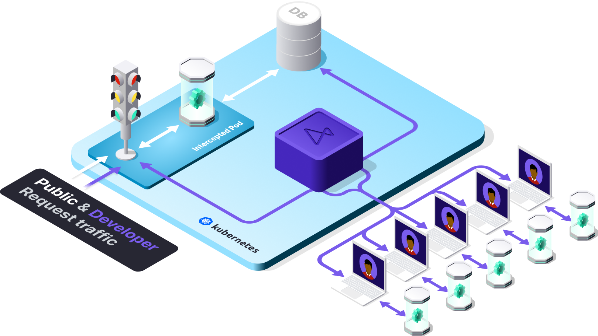
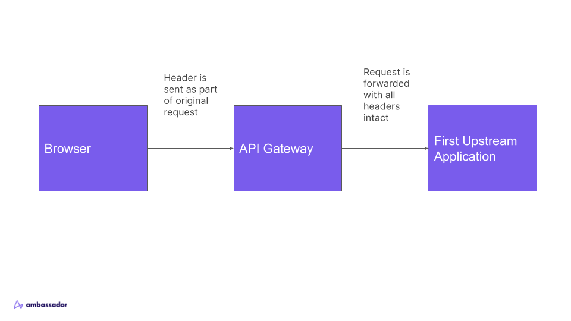
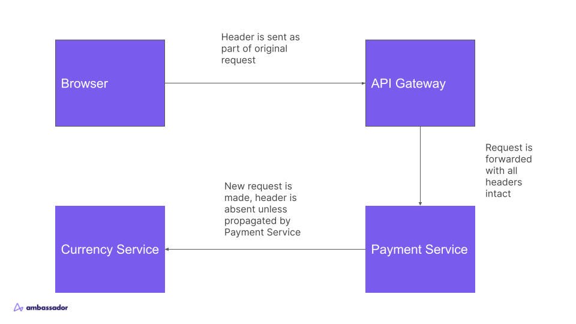

# Header Propagation Methods for Telepresence for Teams

## Table of Contents

* [Background](#background)
* [The Challenge](#the-challenge)
* [The Solution](#the-solution)

## Background

[Telepresence](https://www.getambassador.io/products/telepresence) is a developer productivity
tool that connects your local development environment to a cluster, allowing you to maintain
your favorite local development practices, while working as if you were in your integration
environment. You can run `$ telepresence connect` and talk to pods in the cluster
via your browser or curl as if you were a pod in the cluster.

You can also _Intercept_ pods in the cluster and have requests to that pod come to the locally
running code on your laptop, bringing the fast feedback of local development to Kubernetes.

The [Open-Source version of Telepresence](https://www.telepresence.io/) intercepts _all_ traffic
to a pod. This can work for some teams, but a major limitation is if two developers need to work
on the same application concurrently, or if adding latency or potential bugs to the integration
environment is unacceptable.

For these cases, Ambassador Labs offers a feature in Telepresence for Teams called the
_Personal Intercept_. When using a Personal Intercept, Telepresence can selectively route requests
to a developer's computer based on an HTTP header value. By default, Telepresence looks for the
header `x-telepresence-id`, and a logged in Telepresence user is assigned a unique value for that
header on any intercept they create. I get my test requests, my coworker gets her test
requests, and the rest of the traffic to the application goes to the original pod in the cluster.

## The Challenge

Because Personal Intercepts rely on an HTTP header value, that header must be present in any request
I want to intercept. This is very easy in the first service behind an API gateway, as the header can
be added using Ambassador Labs' [Preview URL feature](https://www.getambassador.io/docs/telepresence/latest/howtos/preview-urls#share-development-environments-with-preview-urls),
browser plugins or in tools like Postman, and the entire request, with headers intact,
will be forwarded to the first upstream service.

However, the original request terminates at the first service that receives it. For the intercept header
to reach any services further upstream, the first service must _propagate_ it, by retrieving the header value
from the request and storing it somewhere or passing it down the function call chain to be retrieved
by any functions that make a network call to the upstream service.

Depending on the programming language the services are written in and environment of the services, this has
historically represented a Herculean task, requiring manually updating the code along every function call path
to propagate the `x-telepresence-id` header. This is obviously not a realistic scenario for most organizations.

## The Solution

Thankfully, there is a class of tooling that has matured rapidly in the last several years that also relies on
HTTP headers: observability. For most languages, adding support for Personal Intercepts is now a quick copy/paste, and for
C#, Java, Node and Python, it requires no code modification at all. If you are using or evaluating Telepresence
for Teams and your environment does not already support header propagation, Ambassador Labs recommends
using OpenTelemetry packages and Kubernetes tooling, and the `baggage` header, to quickly and easily get
your Kubernetes services ready for Personal Intercepts.

### What is OpenTelemetry?

[OpenTelemetry](https://opentelemetry.io/) (commonly shortened to `OTel`) is a [Cloud Native Computing Foundation](https://cncf.io) project
with the goal of providing "high-quality, ubiquitous, and portable telemetry to enable effective observability."
It has [largely unified](https://opentelemetry.io/docs/what-is-opentelemetry/) previous standards for tracing and metrics,
and is in the process of doing the same for logging. It has SDKs for [eleven of the most popular programming languages](https://opentelemetry.io/docs/instrumentation/)
and their major frameworks. It is used by organizations like [EBay](https://opentelemetry.io/blog/2022/why-and-how-ebay-pivoted-to-opentelemetry/)
and [Apple(https://www.youtube.com/watch?v=dFKpbfGJVxI). It is backed and supported by
[every major observability vendor](https://opentelemetry.io/ecosystem/vendors/). Simply put, OpenTelemetry is
the new industry standard for exporting observability data from your infrastructure and applications, which is
why we can recommend using it without reservation. Investing in it for Telepresence for Teams also sets your
organization up for success for larger observability efforts.

### How OpenTelemetry Baggage Unlocks Telepresence for Teams

#### Baggage

In addition to traces, metrics and logs, OTel has a signal called [Baggage](https://opentelemetry.io/docs/concepts/signals/baggage/).
Quoted from the linked page:

"In OpenTelemetry, Baggage is contextual information that’s passed between spans. It’s a key-value store that
resides alongside span context in a trace, making values available to any span created within that trace.

For example, imagine you want to have a CustomerId attribute on every span in your trace, which involves
multiple services; however, CustomerId is only available in one specific service. To accomplish your goal,
you can use OpenTelemetry Baggage to propagate this value across your system."

Mechanically, Baggage is passed via a `baggage` header that is a set of key-value pairs, like
`customerid=123,accountid=456`.

#### Use with Telepresence

How does that help us with Telepresence, which is looking for the `x-telepresence-id` header?

Telepresence has an option to customize the HTTP header it should look for. This option can be passed with the
`--http-header` flag in the CLI or included in an
[Intercept Specification](https://www.getambassador.io/docs/telepresence/latest/reference/intercepts/specs#configuring-intercept-using-specifications).
We can customize it to look for a specific key-value pair in the baggage header.

Baggage is intended to be used for trace-relevant data, so shoving `x-telepresence-id` in there is bad practice
(and not fun to type). We recommend using `devid` in its place, which could also be used to find your test
requests within your distributed tracing tools, in addition to powering Personal Intercepts.

A CLI example is `telepresence intercept --http-header='baggage=.*devid=123456.*' --port 8080:8080 myservice`

That will find the `devid=123456` key-value pair anywhere in the baggage header using regex. The value you use
for `devid` is up to your organization. Since this should only be used in your non-production environments, an
email or other unique personal identifier could be used, or some other scheme can be figured out on your dev teams.
The only requirement is that the value is unique to the developer.

### Using OpenTelemetry Auto-Instrumentation

OTel has auto-instrumentation available for most major languages/frameworks that propagate Baggage values by default.
This is the key that saves your teams from having to instrument their code.

This guide provides installable sample apps that demonstrate:

How quick and easy it is to add Baggage propagation to services written in
* C++
* Erlang/Elixir
* Go
* PHP
* Ruby
* Rust
* Swift
by adding convenient auto-instrumentation packages to a pair of services written in Ruby and Go.

How adding propagation requires _no code modification_, only a simple deployment by a platform team, for services written in
* .NET
* Java
* NodeJS
* Python
using the [OpenTelemetry Operator for Kubernetes](https://opentelemetry.io/docs/k8s-operator/).
Auto-instrumentation can also be added to the code for these languages similarly to the longer list
above if that is your team's preferred solution.

If adding all OpenTelemetry auto-instrumentation is not desired, with a small amount of additional work
the instrumentation packages can be set up manually and set to only propagate the Baggage signals,
in most cases by only adding the Baggage propagator package, or by setting the environment variable `OTEL_PROPAGATORS=baggage`.

## Examples

In the [examples](./examples) directory we offer examples for using [auto-instrumentation](./examples/instrumentation)
or the [K8s Operator](./examples/operator). The goal of these examples is to
* offer and installable set of applications you can use to quickly test using the `baggage` header with Telepresence
* show how little code change is required to get header propagation
The apps themselves are very simple to better highlight what needed to be added to get header propagation working.
Additionally, the author has made their best attempt to write idiomatic code for each language, but PRs are accepted on
improving that.

The architecture of both directories is an application that receives a request at `/uppercase?subject=<somestring>` which
forwards the request (and propagates the headers!) to another service listening on `/finalupper?subject=<somestring>` to
actually do the uppercasing of the string. You should be able to `telepresence intercept` either or both applications
using the above `--http-header` flag and get the correct requests routed to your locally running service.

To try out either set of apps
* get a remote cluster or a local one using a tool like [Kind](https://kind.sigs.k8s.io/) or [MiniKube](https://minikube.sigs.k8s.io/docs/)
* [Install the Telepresence CLI locally](https://www.getambassador.io/docs/telepresence/latest/install)
* Run `$ telepresence helm install --team-mode`
* Run `$ telepresence connect`
* Follow the instructions below for the set of apps you want to test

### Auto-Instrumentation Packages

In the [instrumentation](./examples/instrumentation) directory there is a [Ruby](./examples/instrumentation/ruby) service that
listens on `/uppercase` and forwards the request to a Go service that performs the uppercase action.

For **Ruby** we've followed the [Ruby quickstart](https://opentelemetry.io/docs/instrumentation/ruby/getting-started/) but for a
simple Sinatra app. There is a large amount of instrumentation libraries for other Ruby frameworks in the
[OTel Registry](https://opentelemetry.io/ecosystem/registry/?language=ruby).

For **Go**, we are using the Gorilla Mux instrumentation from the
[OTel Registry](https://opentelemetry.io/ecosystem/registry/?s=Gorilla&component=&language=go).
Golang is a language that discourages "magic" so propagation requires a bit more work than other languages, but utilizing the libraries
for your framework from the Registry is the fastest way to get Baggage headers onto the Context in your app, and then it can be
easily accessed when you make outgoing calls.

#### Testing it out

* `$ kubectl apply -f examples/instrumentation/k8s.yaml`
* `$ cd examples/instrumentation/go && go mod download && go run main.go`
* `$ telepresence intercept --http-header='baggage=.*devid=123456.*' --port 8080:8080 finalupper-go`
* `$ curl -H 'baggage: devid=123456' 'http://uppercase-ruby.default:8080/uppercase?subject=helloworld'` or in your favorite API testing app make an equivalent request
* You should see your running Go process print the uppercased version of your string!

### Operator for Kubernetes

In the [operator](./examples/operator) directory there is a [Node](./examples/operator/node) service that listens
on `/uppercase` and forwards the request to a [Java](./examples/operator/java) service that performs the uppercase action.

For both, there are no OTel libraries installed. Instead, we install the OTel K8s Operator and an `Instrumentation` object
(found in the [k8s.yaml](./examples/operator/k8s.yaml) file), and annotate the deployments to be injected with auto-instrumentation.

#### Testing it out

* Install cert-manager (a dependency of the operator)
  * `$ helm repo add jetstack https://charts.jetstack.io && helm repo update`
  * `$ helm install cert-manager jetstack/cert-manager --namespace cert-manager --create-namespace --set installCRDs=true`
* `$ kubectl apply -f https://github.com/open-telemetry/opentelemetry-operator/releases/latest/download/opentelemetry-operator.yaml`
* `$ kubectl apply -f examples/operator/k8s.yaml`
* `$ cd examples/operator/java/finalupper && gradle assemble && java -jar ./build/libs/finalupper.jar`
* `$ telepresence intercept --http-header='baggage=.*devid=123456.*' --port 8080:8080 finalupper-java`
* `$ curl -H 'baggage: devid=123456' 'http://uppercase-node.default:8080/uppercase?subject=helloworld'` or in your favorite API testing app make an equivalent request
* You should see your running jar print the uppercased version of your string!
